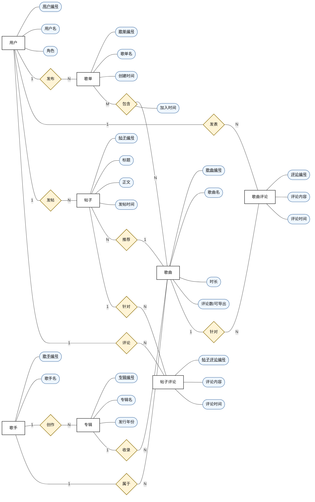

# 音乐库系统 ER 图草图

这份草图按课件 [2-conceptual data model.pptx](</C:/Users/27726/Documents/lxt/Learning/Sophomore/Second term/数据库系统/数据库系统/2-conceptual data model.pptx>) 中的 E-R 标准整理：

- 实体类型用矩形
- 联系类型用菱形
- 属性用椭圆样式
- 标识符属性加下划线
- 联系旁标注 `1`、`N`、`M`
- 尽量用“概念实体/联系”表达，而不是直接把中间表照搬成实体

## 推荐交付版

优先使用最终成图文件 [ER图_3x4.svg](</C:/Users/27726/Documents/lxt/Learning/Sophomore/Second term/数据库系统/数据库系统/poj1/ER图_3x4.svg>)。这是一张手工排版的 `3:4` 竖版图，连线比 Mermaid 自动布局更规整，交叉更少。

## 这张图和数据库表的对应关系

- `用户` 对应 `Users`
- `歌手` 对应 `Artists`
- `专辑` 对应 `Albums`
- `歌曲` 对应 `Songs`
- `歌单` 对应 `Playlists`
- `歌曲评论` 对应 `Comments`
- `帖子` 对应 `Posts`
- `帖子评论` 对应 `Post_Comments`
- `包含` 是 `Playlists` 与 `Songs` 的多对多联系，对应中间表 `Playlist_Songs`

## 为什么这样画更符合课件标准

- 课件要求 E-R 图优先表达“实体-联系-属性”，所以我把 `Playlist_Songs` 还原成了 `歌单` 与 `歌曲` 之间的 `包含` 联系，并把 `added_at` 画成联系属性 `加入时间`。
- `Songs.comment_count` 在数据库里由触发器维护，更适合作为“可导出属性”理解，所以保留为 `评论数/可导出`，如果老师更强调纯概念模型，也可以直接删掉它。
- `Posts.recommended_song_id` 被画成 `帖子` 与 `歌曲` 之间的 `推荐` 联系，而不是直接写外键字段，这样更符合概念数据模型的表达习惯。
- 为了保持整张图清晰简洁，我只保留了主标识符和核心业务属性，没有把密码哈希、头像地址、音频地址这类实现层字段全部铺开。

## 如果你要交作业，建议

- 优先使用上面这版，不要直接提交“关系表结构图”。
- 如果老师要求更严格的 Chen 风格，可以把 `评论数/可导出` 删除，让图更纯粹。
- 如果老师要求标出可选参与，可以在 `专辑 - 收录 - 歌曲`、`帖子 - 推荐 - 歌曲` 两处额外备注“歌曲可不属于专辑”“帖子可不推荐歌曲”。
